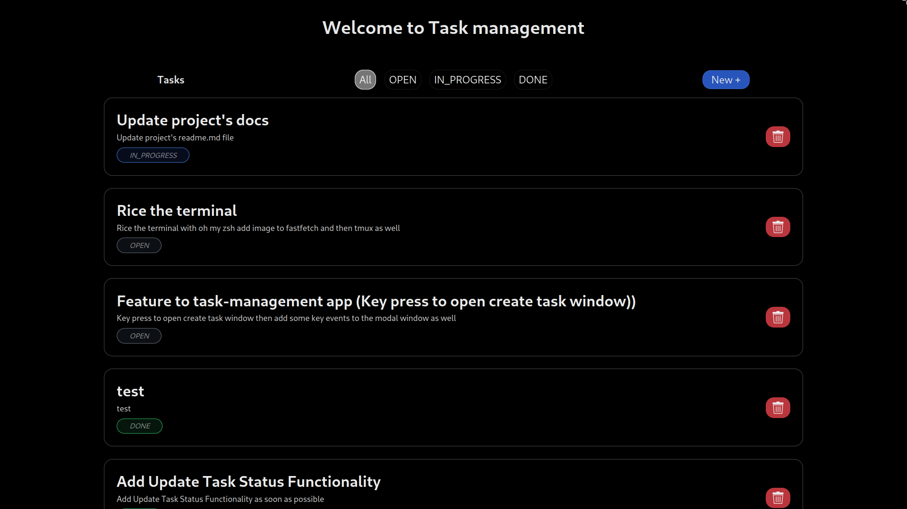
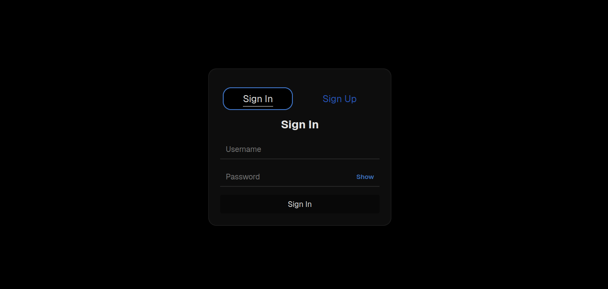
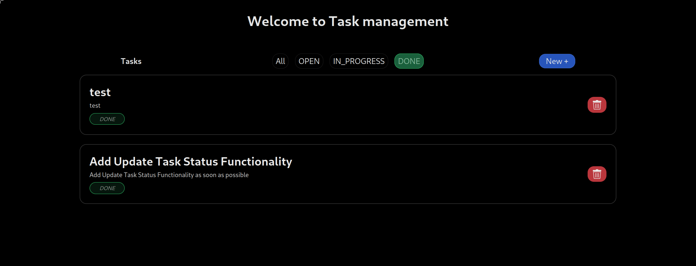
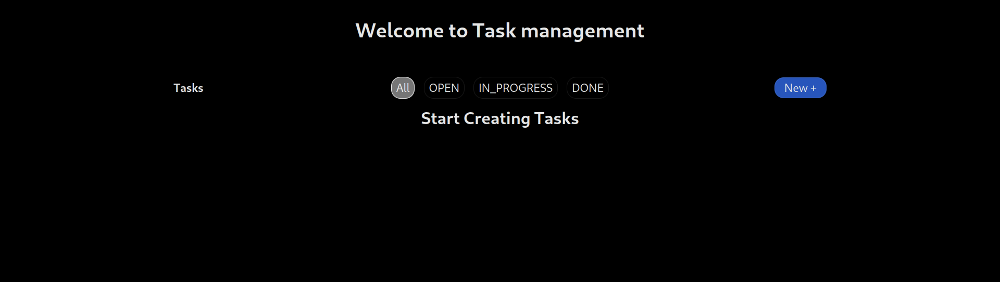
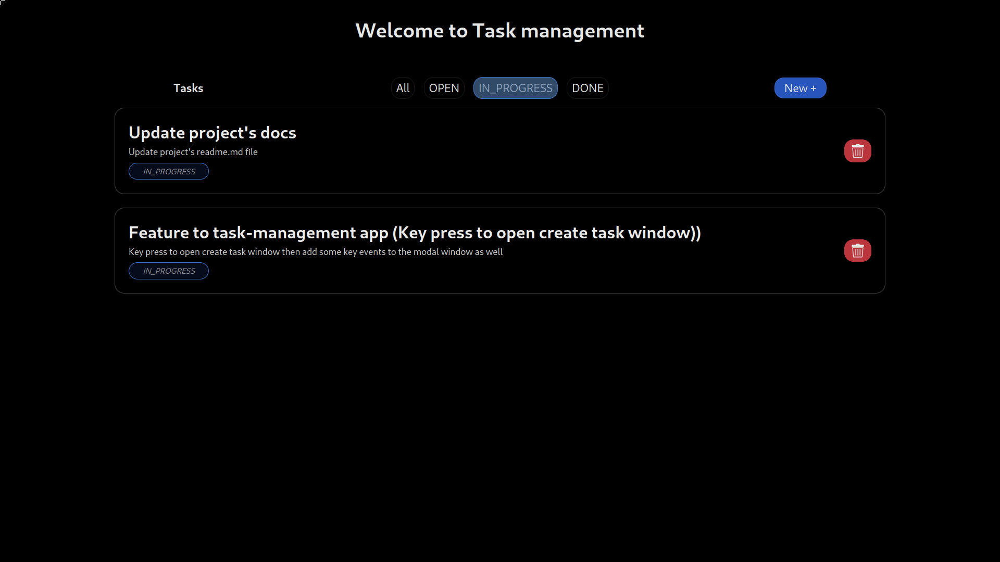

## Task Management Web Application

Welcome to Task management app where authenticated users can create and manage their tasks. Recommended way to use this project is self-host and for the back-end use the docker image provided.

<div style="display: grid; grid-template-columns: repeat(2, 1fr); gap: 10px;">

  
  
  
  
  

</div>

## Tech Stack used

### Frontend

- React
- TypeScript
- NextJS

### Backend

- NestJS
- TypeScript

### DataBase

- PostgreSQL
- TypeORM

## Deployment

Deployed Link - [https://task-management-nest-js.vercel.app](https://task-management-nest-js.vercel.app) **(Completed but this public link requires a server.)**

1. Backend API is hosted using Tailscale.
2. Frontend deployed using Vercel.

Image of this backend app is available in DockerHub.

```bash
docker pull vishnu1183/task-management-nestjs:latest
```

[about self-hosting the backend api](./backend/nestjs-task-management/README.md)
